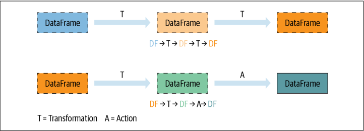
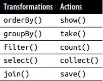

<style>body {text-align: justify}</style>
### Một số khái niệm cần biết:

**_Application:_**
\
Một chương trình người dùng được xây dựng trên Spark và sử dụng API của nó. Bao gồm chương trình điều khiển (driver program) và executors trong cụm.
\
\
**_SparkSession_**
\
Một đối tượng cung cấp điểm vào để tương tác với các chức năng của Spark.
Trong Spark Shell đã cung cấp sẵn SparkSession cho bạn nhưng trong Spark Application, bạn phải tự tạo SparkSession riêng.
\
\
**_Job_**
\
Một chương chình tính toán song song bao gồm nhiều tác vụ được tạo ra để phản hồi cho một Spark action (ví dụ: save(), collect())
\
\
**_Stage_**
\
Mỗi job được phân chia thành các tác vụ nhỏ hơn được gọi là stages, chúng phụ thuộc lẫn nhau.
\
\
**_Task_**
\
Một đơn vị công việc (work) hay thực thi (executor) được gửi cho Spark Executor.

### Spark Jobs

Spark Driver chuyển đổi Spark Application của bạn thành một hay nhiều Spark Jobs.
Nó được chuyển đổi từng job vào một DAG (Directed Acyclic Graph)


Hình 1: Spark Driver tạo thành một hay nhiều Spark Jobs.

### Spark Stages
Là một phần của DAG nodes, stages được tạo nên dựa trên các hoạt động có thể được thực hiện theo chuỗi hay song song.
Không phải hoạt động nào của Spark cũng có thể xảy ra trên 1 stage, vì vậy nó có thể chia thành nhiều stage.


Hình 2: Spark Job tạo một hay nhiều stage (giai đoạn)

### Spark Tasks
Mỗi stage bao gồm các Spark Tasks (một đơn vị thực thi), được liên kết trên mỗi Spark executor.
Ví dụ một Executor với 16 cores có thể có 16 task hoặc hơn làm việc trên 16 partitions hoặc hơn, làm cho việc xử lý task cực kỳ song song!


Hình 3: Spark Stage tạo một hay nhiều task được phân phối đến executor.

### Transformation, Actions and Lazy Evaluation.
Spark operations trên dữ liệu phân tán có thể phân thành 2 loại: _tranformations_ và _actions_.
\
\
Transformations: Chuyển đổi Spark DataFrame thành một DataFrame mới mà không làm thay đổi data gốc, mang lại cho nó đặc tính bất biến (immutability). 
\
\
Tất cả các tranformations được đánh giá một cách lười biếng (Evaluated Lazily), có nghĩa là kết quả không được tính toán trực tiếp, mà nó được ghi lại như là một _lineage_ .
Việc này cho phép Spark sau đó sắp xếp lại một số transformations nhất định, hợp nhất hay tối ưu hóa chúng thành các giai đoạn với hiệu quả cao hơn.
Đồng thời mang lại khả năng phục hồi khi xảy ra lỗi.


Hình 4: Trong hình, Các transformations T được lưu lại cho đến khi action A được gọi đến. Mỗi tranformations tạo ra một DataFrame mới.
\
\
Hình 5: Một số ví dụ về Tranformations và Actions trong Spark



\
**Ví dụ:** Không có gì xuất hiện khi lệnh .conut() dược thực thi:

```python
# In Python
strings = spark.read.text("../README.md")
filtered = strings.filter(strings.value.contains("Spark"))
filtered.count()

# Output: 20
```

